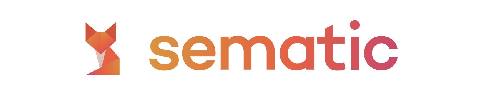
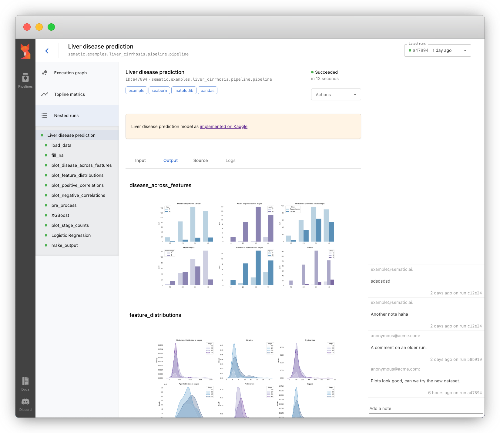

.. image:: https://img.shields.io/pypi/v/sematic?style=for-the-badge
   :target: https://img.shields.io/pypi/v/sematic?style=for-the-badge
   :alt: PyPI

.. image:: https://img.shields.io/circleci/build/github/sematic-ai/sematic/main?label=CircleCI&style=for-the-badge&token=c8e0115ddccadc17b98ab293b32cad27026efb25
   :target: https://app.circleci.com/pipelines/github/sematic-ai/sematic?branch=main&filter=all
   :alt: CircleCI

.. image:: https://img.shields.io/pypi/l/sematic?style=for-the-badge
   :target: https://img.shields.io/pypi/l/sematic?style=for-the-badge
   :alt: PyPI - License

.. image:: https://img.shields.io/badge/Python-3.9+-blue?style=for-the-badge&logo=none
   :target: https://python.org
   :alt: Python 3.9+

.. image:: https://img.shields.io/discord/983789877927747714?label=DISCORD&style=for-the-badge
   :target: https://img.shields.io/discord/983789877927747714?label=DISCORD&style=for-the-badge
   :alt: Discord

.. image:: https://img.shields.io/badge/Made_by-Sematic_🦊-E19632?style=for-the-badge&logo=none
   :target: https://sematic.ai
   :alt: Made By Sematic

Hi 👋
-----

We built the infrastructure behind Cruise's `Continuous Learning
Machine <https://medium.com/cruise/cruise-continuous-learning-machine-30d60f4c691b>`_.
Now we want to bring our learnings to you!

Sematic is an open-source development toolkit to help Data Scientists and Machine
Learning (ML) Engineers prototype and productionize ML pipelines in days not
weeks.

Find our docs at `docs.sematic.ai <https://docs.sematic.ai>`_\ , and join us on
`Discord <https://discord.gg/4KZJ6kYVax>`_.

Sematic helps you

* Bring your prototype ML code from your Notebook to a production pipeline with minimal efforts
* Monitor, visualize, and track all inputs and outputs of all pipeline steps in a slick UI
* Collaborate with your team: keep the discussion close to the pipeline as opposed to scattered elsewhere
* [soon] Clone/re-run your pipelines with different inputs/configs
* [soon] Schedule your pipelines to keep your models fresh and relevant

Installation
------------

Instal Sematic with

.. code-block:: shell

   $ pip install sematic

Usage
-----

Start the app locally with

.. code-block:: shell

   $ sematic start

Then run an example pipeline with

.. code-block:: shell

   $ sematic run examples/mnist/pytorch

Create a new boilerplate project

.. code-block:: shell

   $ sematic new my_new_project

Or from an existing example:

.. code-block:: shell

   $ sematic new my_new_project --from examples/mnist/pytorch

Then run it with

.. code-block:: shell

   $ python3 -m my_new_project

See our docs at `docs.sematic.ai <https://docs.sematic.ai>`_\ , and join us on
`Discord <https://discord.gg/4KZJ6kYVax>`_.

Contribute
----------

See our Contributor guide at `docs.sematic.ai <https://docs.sematic.ai>`_.
