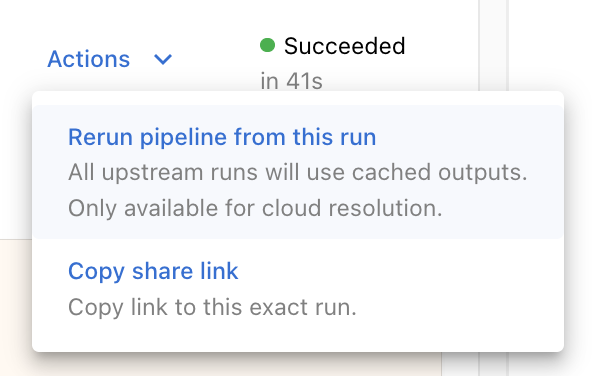
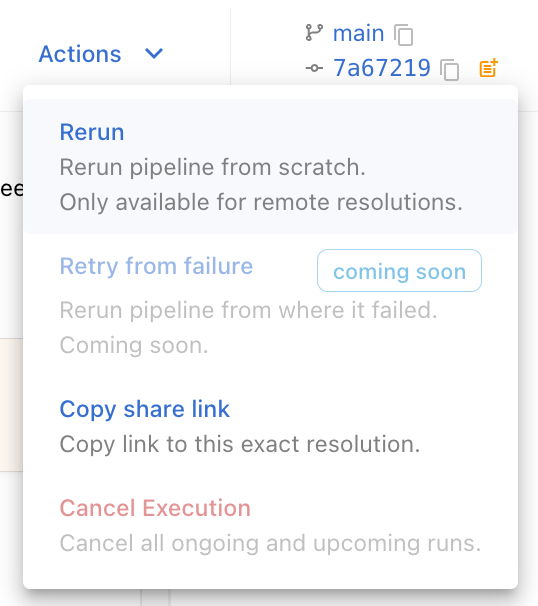

## Re-running Executions

There are cases when you would want to duplicate an existing pipeline
[Resolution](glossary.md#resolution), only to re-execute one or two
[Run](glossary.md#run). For example, you might have experienced an external
resource outage that caused the pipeline to fail mid-execution, and you just
want to be able to pick up the execution from where it failed. Or you might
have an expensive pipeline that failed with a corner case bug, and after
patching it, not have to re-execute the entire pipeline.

In these cases, you can just reuse an original Resolution, while only
invalidating a specific Run.

For cloud executions that don't require code changes, such as in the outage
example, you can just go to the panel of the offending Run in the Dashboard and
click the re-run option from the Run `Actions` drop-down:



You can also re-run the entire Resolution, which is equivalent to re-submitting
the pipeline from scratch, by clicking the corresponding option on the
Resolution `Actions` drop-down:



In both of these cases, the same Docker image that was submitted for the
original run is reused.

For cases when code updates are required, such as in the bug patching example,
or for cases where you want to re-run a Resolution that was executed locally
instead of in the cloud, you need to re-run the Resolution programmatically.
This can be done by passing the value of the `Run ID` that you want to
re-execute to the `rerun_from` parameter when instantiating the
[LocalResolver](api.md#localresolver) or the
[CloudResolver](api.md#cloudresolver). The Resolver submission will then
package the new version of the pipeline code, clone the original Resolution and
only re-execute the specified Run and any of its
[nested](glossary.md#parent-child-run) or
[downstream](glossary.md#upstream-downstream-function) Runs, using this new
version of the code.

Example API usage:

```python
my_pipeline([...]).resolve(CloudResolver(rerun_from="<my-run-id>"))
```

## Caching Func Runs

If you have deterministic functions which take the exact same inputs between
[Resolutions](glossary.md#resolution) and whose executions take a lot of time
or resources to complete, such as data pre-processing, then you can mark those
functions for caching, under a specific caching namespace.

On every invocation of a function marked in this way, Sematic checks if that
function had been already invoked in the past with the same effective input
values. If so, the resulting output [Artifact](glossary.md#artifact) from that
original [Run](glossary.md#run) is directly used as this new invocation's
output. This means that any potential functions nested under this function will
not be invoked either. If no prior run matches, the function is executed as
usual.

These cached Artifacts can be grouped together under a specific cache
namespace, in order to manage the caching behavior between different pipelines
that reuse the same cached funcs, or to  invalidate the cache. this namespace
can either be a string, or a `Callable` which takes as input the root
[Future](glossary.md#future) and returns a string. This `Callable` will be
executed immediately after the Resolution starts.

In order to enable this behavior:

- Enable the cache flag on the function definition:
    ```python
    @sematic.func(cache=True)
    def my_function([...]) -> [...]:
      [...]
    ```

- Instantiate the [Resolver](glossary.md#resolvers) with a cache namespace:
    ```python
    my_pipeline([...]).resolve(CloudResolver(cache_namespace="my namespace"))
    ```

## Context

Sometimes you may want to record the results of an execution with
a third party or custom tool. In this case, you would want to
preserve the ability to reference the Sematic run that the results
came from. Sematic provides an API you can use to do this directly
within your Sematic funcs:

```python
import sematic

@sematic.func
def add(a: int, b: int) -> int:
    result = a + b

    # track this run's results with some hypothetical
    # experiment management tool.
    some_experiment_manager().record_result(
        sematic.context().run_id, {
            "a": a,
            "b": b,
            "result": result,
        }
    )
    return result
```

The context object returned by `sematic.context()` contains both the `run_id` for the
execution of the current func, as well as the run id for the root run of the pipeline
currently being executed (in `root_id`).
