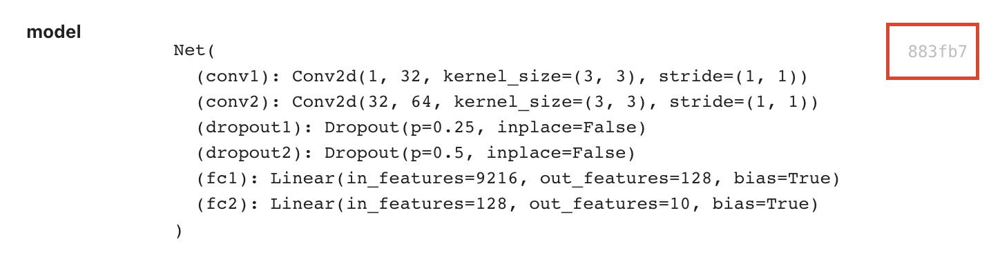

# Artifacts

Each individual input arguments and output value of Sematic functions are
serialized, persisted, and tracked by Sematic.

For example, for the following function

```python
@sematic.func
def foobar(foo: Foo, bar: Bar) -> Output:
    # business logic
    return output
```

three artifacts will be created:

* One for the input argument `foo`
* One for the input argument `bar`
* One for the output value `output`

## Accessing artifacts

In order to access an artifacts values from outside your pipeline, find the artifact you want to access in the UI, and click on its artifact ID to copy it:




then simply do:

```python
from sematic import get_artifact_value

value = get_artifact_value("<artifact ID>")
```


An artifact ID is 40 character long. The UI only displays the first 6 characters. Make sure to click the ID to copy the entire ID.
