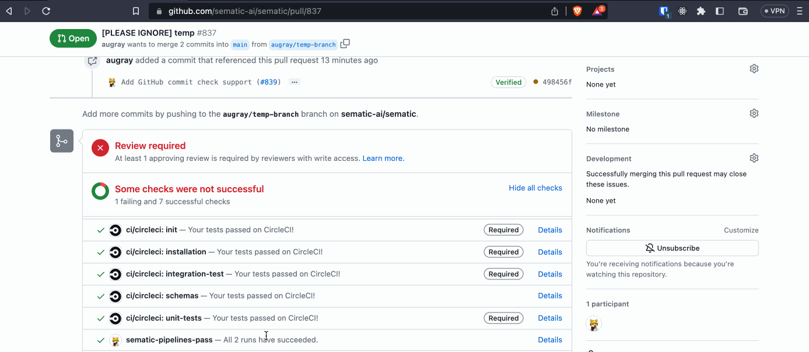
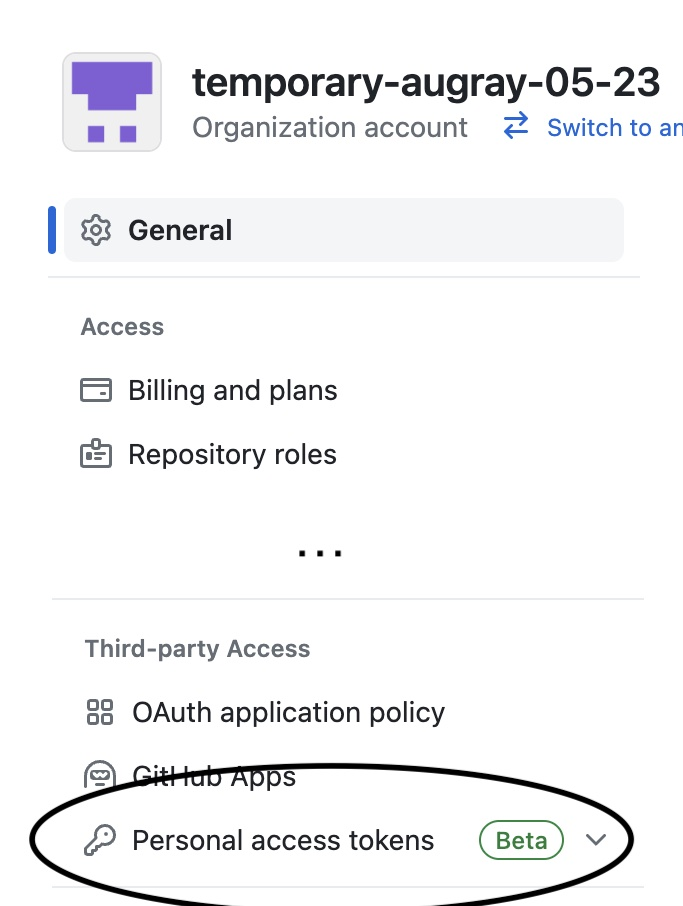
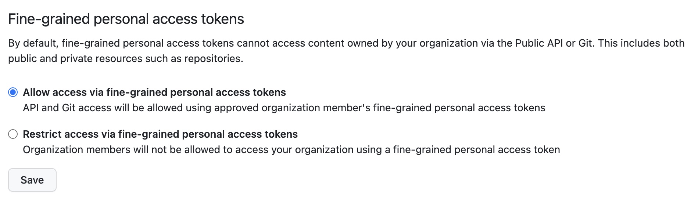

# GitHub[^1]

## Summary

At Sematic, we believe testing is crucial to enhancing your development loop, whether
it be "traditional" code, [unit testing of ML pipelines](./testing.md), or running full
[regression pipelines](https://www.sematic.dev/blog/continuous-learning-for-safer-and-better-ml-models)
involving your data and models.

If you have deployed Sematic EE[^1], you can configure it to integrate with GitHub such
that you can validate your commits (for PRs or any other purpose) using Sematic runs.



The key idea is that once you have configured Sematic and GitHub, you can launch
Sematic runs from your CI. Any run you tag with `checks-commit:<git commit sha>`
will be considered by Sematic to be required to succeed in order to approve the
commit. Sematic will automatically update GitHub as the relevant runs complete.

## GitHub Configuration

In order to use this Sematic plugin, you first need to configure GitHub
to allow and use it. The following steps must be done by somebody with
permissions to administer the GitHub organization that you wish to integrate
with Sematic.

### Getting an access token for usage by Sematic

This section describes how you can get a
[personal access token](https://docs.github.com/en/authentication/keeping-your-account-and-data-secure/about-authentication-to-github#authenticating-to-the-api-with-a-personal-access-token)
that Sematic can use to access the GitHub API to update it on commit statuses.


You may wonder why we use a "personal" access token rather than an app token.
The key idea is that using an app token on your own deployment of Sematic would
require you to expose your deployment to the internet to interact with GitHub's
OAuth flow. In an effort to help keep your infrastructure simpler and more flexible,
we've opted to go with personal access tokens instead. Luckily we can also scope
the token's access very narrowly so there's little risk for misuse.


#### Allow Usage of Personal Access Tokens

The first step in enabling access for Sematic is to ensure that your organization
allows API access using personal access tokens. You can, at your discretion,
require that each new access token must be approved by an organization administrator
before it is allowed API access.

To begin, go to your GitHub organization's settings page. Then navigate to the
"Personal access tokens" menu item and click on "Settings."

*Organization Settings > Third-party Access section > Personal access tokens > Settings*




Once you've done that, you need to indicate that your organization will allow usage of
personal access tokens.



Below this, there is also an option to require that new tokens be approved by
an organization administrator before they can be used. While not required for
Sematic to work, this is generally a good idea if you might be worried about
organization members misusing GitHub API access.

Once you've enabled access, don't forget to use the "Save" button so that the
settings take effect!

#### Create a Personal Access Token
```TODO: Refine```

*User settings > Developer Settings > Personal access tokens > Fine-grained tokens*

Generate New Token

- fill out name
- fill out description
- set expiration for one year
- Select "Resource owner" to be the GitHub organization you wish to check commits in
- Under "Repository access", select repositories you wish to use Sematic's GitHub integration with
- *Permissions > Repository permissions > Commit statuses*. Set access to "Read and write"
- "Generate Token" button
- Copy the token, save it to a secure place

#### Approve Personal Access Token
```TODO: Refine```

This step is only required if you required administrator approval for
Personal Access Token usage in the
[Allow Usage of Personal Access Tokens](#allow-usage-of-personal-access-tokens)
section above.

*Organization Settings > Third-party Access section > Personal access tokens > Pending requests*

Approve the Personal Access Token request.

### Requiring Sematic Checks to Pass

(Optional)

```TODO: Write```

## CI Configuration

```TODO: Write```

## Sematic Configuration

```TODO: Write```

[^1]: This feature of Sematic is only available with the "Enterprise Edition."
Before using, please reach out to Sematic via support@sematic.dev to obtain a
license for "Sematic EE."