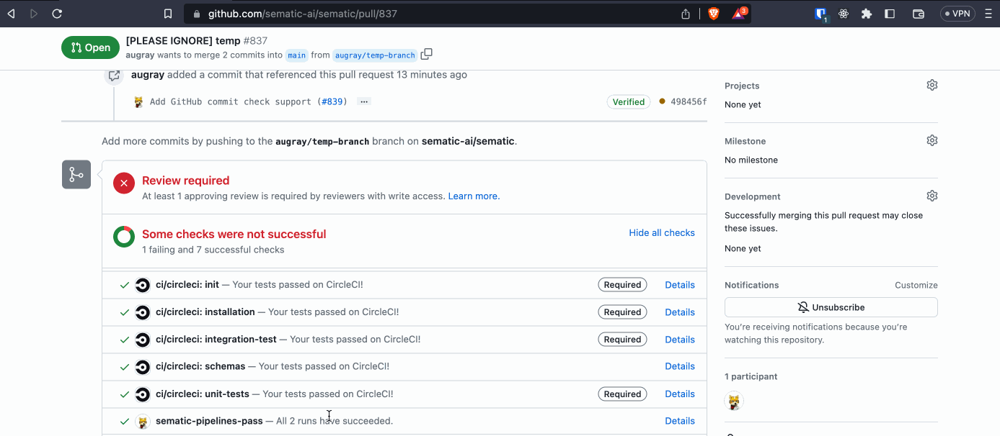

# GitHub

## Summary

At Sematic, we believe testing is crucial to enhancing your development loop, whether
it be "traditional" code, [unit testing of ML pipelines](./testing.md), or running full
[regression pipelines](https://www.sematic.dev/blog/continuous-learning-for-safer-and-better-ml-models)
involving your data and models.

If you have deployed Sematic, you can configure it to integrate with GitHub such
that you can validate your commits (for PRs or any other purpose) using Sematic runs.



The key idea is that once you have configured Sematic and GitHub, you can launch
Sematic runs from your CI. Any run you tag with `checks-commit:<git commit sha>`
will be considered by Sematic to be required to succeed in order to approve the
commit. Sematic will automatically update GitHub as the relevant runs complete.

## GitHub Configuration

In order to use this Sematic plugin, you first need to configure GitHub
to allow and use it. The following steps must be done by somebody with
permissions to administer the GitHub organization that you wish to integrate
with Sematic.

### Getting an access token for usage by Sematic

This section describes how you can get a
[personal access token](https://docs.github.com/en/authentication/keeping-your-account-and-data-secure/about-authentication-to-github#authenticating-to-the-api-with-a-personal-access-token)
that Sematic can use to access the GitHub API to update it on commit statuses.


You may wonder why we use a "personal" access token rather than an app token.
The key idea is that using an app token on your own deployment of Sematic would
require you to expose your deployment to the internet to interact with GitHub's
OAuth flow. In an effort to help keep your infrastructure simpler and more flexible,
we've opted to go with personal access tokens instead. Luckily we can also scope
the token's access very narrowly so there's little risk for misuse.


#### Allow Usage of Personal Access Tokens

The first step in enabling access for Sematic is to ensure that your organization
allows API access using personal access tokens. You can, at your discretion,
require that each new access token must be approved by an organization administrator
before it is allowed API access.

To begin, go to your GitHub organization's settings page. Then navigate to the
"Personal access tokens" menu item and click on "Settings."

*Organization Settings > Third-party Access section > Personal access tokens > Settings*


Once you've done that, you need to indicate that your organization will allow usage of
personal access tokens.


Below this, there is also an option to require that new tokens be approved by
an organization administrator before they can be used. While not required for
Sematic to work, this is generally a good idea if you might be worried about
organization members misusing GitHub API access.

Once you've enabled access, don't forget to use the "Save" button so that the
settings take effect!

#### Create a Personal Access Token

The previous section described how to configure the GitHub organization to
allow API access via Personal Access Tokens. Now you need to actually create
a token that Sematic can use to access the API.

First, go to your GitHub user settings. In the menu, navigate to
"Developer Settings."


From there, go to "Personal access tokens" and then "Fine-grained tokens." Then click
"Generate new token."


Once you're on the page to create a new token, you need to fill out the following:

- **Name**: A simple name for the token's purpose, like "Sematic Commit Checker".
- **Expiration**: The duration that the token will be valid for. When this time expires,
you will need to generate a new token and configure Sematic to use it. It's thus best to
set it for long enough that you won't be too inconvenienced by replacing it.
- **Description**: A simple description of the token's usage. Ex: "A token to use Sematic
runs to validate GitHub commits."
- **Resource owner**: Select the GitHub organization you wish to integrate with Sematic.
If you don't see that organization listed, you may need to go back to the
[Allow Usage of Personal Access Tokens](#allow-usage-of-personal-access-tokens)
section.


- **Repository Access**: Select the repository (or repositories) you wish to allow Sematic
to interact with.
- **Permissions**: Under *Permissions > Repository Permissions*, select "Read and write"
permission for "Commit statuses" access.


Once you have finished configuring the token, click the "Generate token" button at the bottom
of the page. Finally, copy the token you are given and store it in a secure place. You will
need this token later to configure Sematic.

#### Approve Personal Access Token

Now that you have requested a personal access token, you may need to have your
token request approved by an organization administrator. You may be able to skip
this step if: (a) an organization administrator requested the token (in which case the
token request may have been auto-approved), or (b) your organization chose not
to require approval for new Personal Access Token access.

As in the
[Allow Usage of Personal Access Tokens](#allow-usage-of-personal-access-tokens)
section, you first need to navigate to
*Organization Settings > Third-party Access section > Personal access tokens*


From there, open "Pending requests" and review the token request. If the requested
access is in line with the description from 
[Create a Personal Access Token](#create-a-personal-access-token), then approve the
token request.

### Requiring Sematic Checks to Pass

This section describes how you can configure your GitHub to require Sematic checks
to pass before allowing commits to merge to your protected branches (e.g.
`main`/`master`). **It should only be performed once you have successfully**
**executed a Sematic check on one of your commits in your repository.**
If you attempt it before that point, you will not see Sematic's check as an
option to require, and you may risk blocking PRs before you're ready to
have Sematic checks performed.

Once you're ready, go to the repository you wish to add this protection to,
and navigate to its settings page. From there, select "Branches" from the
side menu.


Either edit an existing branch protection rule or add a new one (with the
"Add rule" button), depending on whether the branch you're protecting already
has other protections in place.

Once you're editing the branch protection, ensure the branch name pattern matches
the branch you wish to protect, then go to the "Protect matching branches"
configuration box. There, enable "Require status checks to pass before merging".

You may then search for the `sematic-pipelines-pass` check, and add it to the
list of required checks.


Finally, click the "Save changes" button to finalize your configuration.

## CI Configuration

This section describes how to configure your CI to leverage Sematic's GitHub
integration. Since everyone's CI and infrastructure setup is different, the
details of this step will differ for everyone. However, the high-level steps
remain the same:

1. Ensure your CI has network access to your Sematic deployment.
2. Get a Sematic API key to use via your CI. This can just be the API key of
an individual user (this would be the same as the API key you use for
[`SEMATIC_API_KEY`](./cli.md)).
3. Set the `SEMATIC_API_ADDRESS` environment variable on your CI worker to
point to your Sematic deployment.
4. Set the `SEMATIC_API_KEY` environment variable on your CI worker to
enable Sematic access.
5. Configure your CI to run the CLI command to launch your Sematic
pipelines. Any run that should be considered as a requirement for the check
to pass should have the [tag](./glossary.md#tag)
`checks-commit:<git sha being built by CI>`.
6. Configure your CI to run
`sematic github check-commit sematic-ai/sematic:<git sha being built by CI>`
after all desired pipelines have been launched.

For step 5, you will likely need to edit your launch script to enable tagging
from the command line. For example:

```python
# an example launch script that allows tagging from the command line
import argparse
import sematic
from my_package import my_pipeline


def parse_arguments() -> argparse.Namespace:
    parser = argparse.ArgumentParser("Launch my_pipeline")
    parser.add_argument(
        "-t",
        "--tag",
        dest="tags",
        action="append",
        default=[],
        nargs=1,
        help="Add a tag to the run",
        type=str,
    )
    args = parser.parse_args()
    args.tags = [tag[0] for tag in args.tags]
    return args


def main():
    args = parse_arguments()
    runner = sematic.CloudRunner()
    future = my_pipeline().set(tags=args.tags)
    runner.run(future)


if __name__ == "__main__":
    main()
```

To make a resulting run that was used in Sematic's check,
the pipeline could then be launched from the command line as:

```shell
GIT_COMMIT_SHA=$(git rev-parse HEAD)
bazel run //my_package/my_pipeline:main -- --tag "checks-commit:$GIT_COMMIT_SHA"
```

## Sematic Configuration

Once you have completed [GitHub Configuration](#github-configuration) you
should have a personal access token. Your Sematic server administrator should
configure your
[helm chart](./deploy.md#deployment-option-2-sematic-with-cloud-execution)
for Sematic to have the following settings:

```yaml
github:
  enabled: true
  github_access_token: <TOKEN FROM GITHUB>
```
