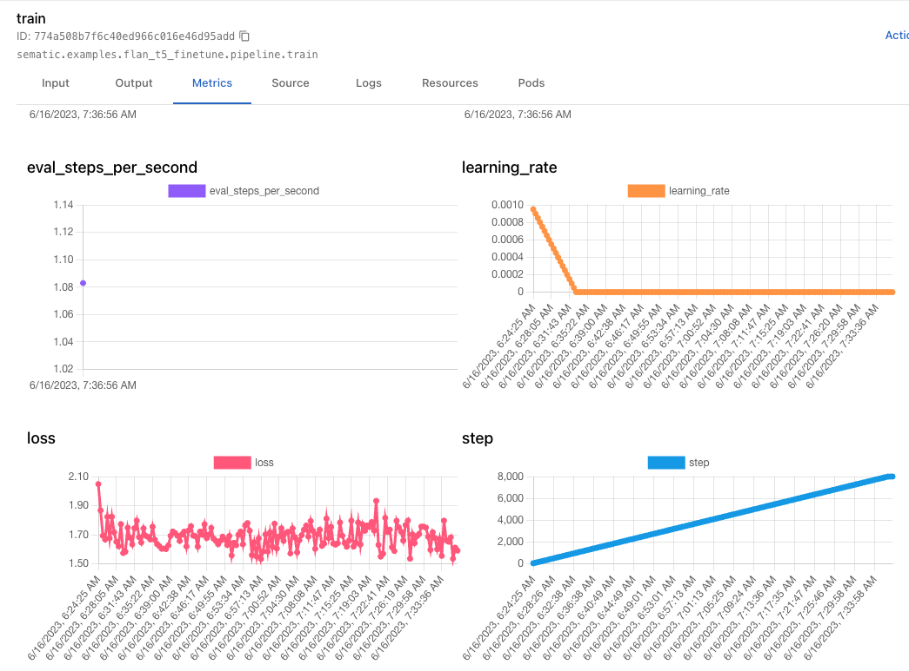

# Metrics

Sematic surfaces a number of high-level metrics in the Dashboard, and lets 

## Pipeline metrics

Pipeline metrics are displayed on the pipeline index page, as well as on the
"Pipeline metrics" panel of the Run details page.

### Run count

This is the total number of runs for this pipeline. This includes all
outcomes (success, failure, cancelation, running, etc.), and counts only runs of
the pipeline's [root function](./glossary.md#root-entry-point-function).

This represents the total number of times the pipeline was submitted, either
from the CLI, the dashboard, or external systems.

### Success rate

The pipeline success rate is the percentage of successful runs among all terminated runs of the pipeline's [root function](./glossary.md#root-entry-point-function).

Terminated runs include successful and failed runs. It does not include canceled
runs as those were intentionally interrupted by users. It does not include
in-progress runs.

### Average run time

The pipeline average run time is the average of the pipeline's wall time
computed over all successful runs. Failed and canceled runs are not included.

## Custom metrics



Custom metrics are an Enteprise feature. Get in touch at
[support@sematic.dev](mailto:support@sematic.dev) to learn more.



In addition to tracking and visualizing inputs and outpus of all your Functions,
Sematic lets you log timeseries metrics during the execution of your pipeline
and surfaces them in the Dashboard in real-time.

This feature can be used to display a loss curve during training or track the
evolution of certain hyperparameters such as learning rate. This is a similar
functionality to what tools like Tensoboard offer.

To log a metric value, simply call the `log_metric` API as such:

```python
from sematic.ee.metrics import log_metric

@sematic.func
def train_model(...):
    for epoch in epochs:
        _train(...)
        
        log_metric("loss", loss)
```

The logged values are plotted in real-time in the Metrics tab of the Run detais page.



### Metric types

Following the [OpenTelemetry
specification](https://opentelemetry.io/docs/specs/otel/metrics/data-model/#point-kinds),
metrics can be aggregated in different ways. Sematic supports the following two
aggregation mode:

* Gauge (default) – within a given aggregation bucket, values are averaged.
* Count – within a given aggregation bucket, values are summed.

By default, metrics logged with `log_metric` are aggregated as gauges. To
specify a different metric type, simply specify the `metric_type` argument:

```python
from sematic.ee.metrics import log_metric, MetricType

@sematic.func
def train_model(...):
    for epoch in epochs:
        _train(...)
        
        log_metric(
            "invalid_images",
            n_invalid_images,
            metric_type=MetricType.COUNT
        )
```