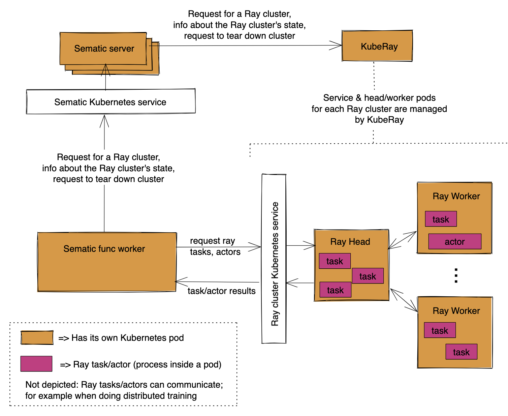

# Ray

## What is Ray?

[Ray](https://www.ray.io/) is a framework for scaling python
workloads, with an emphasis on AI/ML workloads. It has integrations
to allow data processing, distributed training, hyperparameter
tuning and more. It can be used with Sematic to "scale out" your
individual steps (ex: use
[Ray's pytorch integrations](https://docs.ray.io/en/latest/train/api.html#pytorch)
to do distributed training within a single Sematic func for training).
Sematic can then be used to chain together your high-level ML pipeline
(do data processing, then feed the result into training, then feed
the result into evaluation, etc.).

## Using Ray in a Sematic func


**Important**: Before you can use this feature, you need to
[install and configure](#installation-and-configuration)
the integration.


Using Ray within Sematic is as simple as using `with RayCluster(...)`
inside a `@sematic.func`:

```python
import ray
from ray.train.torch import TorchTrainer
from ray.air.config import ScalingConfig
from ray.train.torch import TorchCheckpoint
from sematic.ee.ray import RayCluster, RayNodeConfig, SimpleRayCluster

@sematic.func
def train(
    dataset: MyDatasetReference,
    training_config: MyTrainingConfig,
) -> MyModel:
    n_workers = training_config.n_workers
    with RayCluster(
        config=SimpleRayCluster(
            n_nodes=n_workers,
            node_config=RayNodeConfig(cpu=16, memory_gb=32, gpu_count=1),
        )
    ):
        trainer = TorchTrainer(
            train_loop_per_worker=my_train_func,
            train_loop_config=training_config.train_loop_config(dataset),
            scaling_config=ScalingConfig(num_workers=n_workers, use_gpu=True),
        )

        # Start distributed training using our ephemeral Ray cluster
        result = trainer.fit()
        model = TorchCheckpoint.from_checkpoint(result.checkpoint).get_model(MyModel())
        return model
```

When you use this code, it will:

- Start up an ephemeral Ray cluster. If using the `LocalRunner`, the cluster will
be backed by local processes. If using the `CloudRunner`, the cluster will be
backed by Ray workers that are spun up on your Kubernetes worker.
- Ensure your dependencies are usable for training. Anything you can `import` and
use in your Sematic functions can automatically be imported and used for the code
running on the Ray cluster. The same docker image managed by Sematic will be
used by the Ray workers, so even native dependencies (ex: cuda) are available.
- Only enter the `with RayCluster` block once your cluster is ready to be used.
- Forward logs from Ray workers back to Sematic for display in the Sematic dashboard.
- Execute your training code on the Ray cluster.
- Tear down the cluster when training terminates (successfully or with a failure).

### Architecture



When you use `with RayCluster(...):` inside a Sematic func, your Sematic func
asks the Sematic server to allocate a Ray cluster. The Sematic server generates
a manifest describing that cluster, which it then posts for
[KubeRay](https://github.com/ray-project/kuberay) to use. KubeRay initializes
a Kubernetes service for the new cluster, as well as pods for the Ray head node
and Ray workers.

Once the Ray cluster has been initialized, the Sematic func that requested the
cluster enters the body of the `with RayCluster(...):` code block and can make
requests to the new Ray cluster. The Sematic func that does this usually doesn't
need many compute resources, as the "heavy lifting" of computing is usually being
taken care of by the Ray head and worker nodes. The Sematic func requests work
to be done on the Ray cluster. This work ultimately takes the form of Ray
[tasks/actors](https://docs.ray.io/en/latest/ray-core/key-concepts.html), though
the author of the Sematic func may be using a higher-level library to generate
these (such as
[Ray Lightning](https://docs.ray.io/en/latest/ray-more-libs/using-ray-with-pytorch-lightning.html#using-ray-with-pytorch-lightning)
for distributed pytorch training).

Multiple tasks/actors may coexist on any given Ray worker/head node, depending
on the resources that head/worker have available and the resources requested
by each task/actor.

Once the Sematic func is done using the Ray cluster, and completes the
`with RayCluster(...)` context, it makes a request to the Sematic server
to tear down the Ray cluster. The server then relays this request to
KubeRay, which deallocates any resources that it had allocated for the
cluster.

### Examples

To demonstrate the power of Sematic + Ray, we have created two examples of using
them to do distributed training from within a Sematic pipeline:

1. Using ["PyTorch Lightning"](https://pytorch-lightning.readthedocs.io/en/stable/index.html),
an opinionated wrapper around raw [PyTorch](https://pytorch.org/) that helps standardize the
structure of train/eval loops, logging of metrics, and more. Here's
[our example](https://github.com/sematic-ai/sematic/blob/main/sematic/examples/lightning_resnet/README.md)
using it to do distributed training on a ResNet model.

2. Using Ray's ["AI Runtime"](https://docs.ray.io/en/latest/ray-air/getting-started.html)
(aka "Ray AIR") to distributed train a simple image classifier. Here's
[our example](https://github.com/sematic-ai/sematic/blob/main/sematic/examples/cifar_classifier/README.md)


### Detailed API

#### RayCluster

A representation of the cluster that will be created.

- **config** (*[`RayClusterConfig`](#rayclusterconfig)*): A configuration for
the compute resources that will be started. If using `LocalRunner` or
`SilentRunner`, this will be ignored and a local cluster will be started instead.
- **forward_logs** (*bool*): Whether or not to have logs from Ray workers returned
back to the stdout of the Sematic func this resource is used in. Sets `log_to_driver`
in [`ray.init`](https://docs.ray.io/en/latest/ray-core/package-ref.html?highlight=init#ray.init)
- **activation_timeout_seconds** (*float*): The number of seconds the cluster has
to initialize itself before a timeout error occurs.

#### RayClusterConfig

Represents the compute resources the cluster will use. Allows using autoscaling
of the Ray cluster, configuring multiple scaling groups with different
characteristics, and using workers that differ from the head. If you wish
to create a `RayClusterConfig` with a fixed number of identical workers,
see [`SimpleRayCluster`](#simpleraycluster)

- **head_node** (*[`RayNodeConfig`](#raynodeconfig)*): The configuration
for the head node.
- **scaling_groups** (*[`List[ScalingGroup]`](#scalinggroup)*): A list of
scaling groups. Each scaling group may have different properties for the
nodes in the group.
- **autoscaler_config** (*[`Optional[AutoscalerConfig]`](#autoscalerconfig)*): The
configuration for the autoscaler. Required if there is at least one scaling
group which has `max_workers` greater than `min_workers`. The autoscaler is
not enabled if all scaling groups have `max_workers == min_workers`, even if
this configuration is specified. Defaults to `None`.

#### SimpleRayCluster

Utility function for creating [`RayClusterConfig`](#rayclusterconfig) for
clusters with a fixed number of uniform workers.

- **n_nodes** (*int*): The number of nodes in the cluster, including the
head node
- **node_config** (*[`RayNodeConfig`](#raynodeconfig)*): The configuration
for each node in the cluster
- **max_nodes** (Optional[int]): The maximum number of nodes in the cluster
(including the head node). Defaults to be equal to `n_nodes`. Must be greater
than or equal to `n_nodes`.
- **autoscaler_config** (*[`Optional[AutoScalerConfig]`](#autoscalerconfig)*): The
configuration for the autoscaler. Required if `max_nodes` is greater than
`n_nodes`. The autoscaler is not enabled if `max_nodes == n_nodes`, even if
this configuration is specified. Defaults to `None`.

#### RayNodeConfig

The compute characteristics of a single Ray head/worker.

- **cpu** (*float*): Number of CPUs for each node (supports fractional CPUs).
- **memory_gb** (*float*): Gibibytes of memory for each node
(supports fractional values). Note: One
[gibibyte](https://simple.wikipedia.org/wiki/Gibibyte) is
`2**30` bytes.
- **gpu_count** (*int*): The number of GPUs to attach. Not all deployments
support GPUs, or more than one GPU per node.

#### ScalingGroup

A group of workers that all have the same compute characteristics.

- **worker_nodes** (*[`RayNodeConfig`](#raynodeconfig)*): A description
of the compute resources available for each node in the scaling group.
- **min_workers** (*int*): The minimum number of workers the scaling
group can scale to. Must be non-negative.
- **max_workers** (*int*): The maximum number of workers the scaling
group can scale to. Must be equal to or greater than min_workers.
For a fixed-size scaling group, set this equal to min_workers.

#### AutoscalerConfig

The configuration for the autoscaler. The autoscaler will run in the same
Kubernetes pod as the Ray head. Thus your Kubernetes cluster must have
a single node available which can supply BOTH the resource requirements
of the Ray head AND of the autoscaler.

- **cpu** (*float*): Number of CPUs for each node (supports fractional CPUs).
- **memory_gb** (*float*): Gibibytes of memory for each node
(supports fractional values). Note: One
[gibibyte](https://simple.wikipedia.org/wiki/Gibibyte) is
`2**30` bytes.

## Installation and configuration

### Pip package

Instead of depending on `sematic`, you will need to depend on `sematic[ray]`
or `sematic[all]`.

### Helm chart

Ensure that you are using an [EE server](https://hub.docker.com/r/sematic/sematic-server-ee)
OR v0.41.0 or higher of the standard server.
Then you will need to install Kuberay into your Kubernetes environment.

#### Installing Kuberay

This can be done via helm, with instructions
[here](https://ray-project.github.io/kuberay/deploy/helm/). Please install the latest
stable version, and not the nightly one! You probably want to use a
`singleNamespaceInstall`  (see
[here](https://github.com/ray-project/kuberay/blob/2600854c61673f2b7da9fe2b54c8220468c1a013/helm-chart/kuberay-operator/values.yaml#L62)) and install it in the same namespace as Sematic. You will probably want to apply
a configuration for a simple ray cluster (such as
[this](https://github.com/ray-project/kuberay/blob/master/ray-operator/config/samples/ray-cluster.complete.yaml))
to verify the deployment. You can delete that cluster once you have verified that the
appropriate pods are created and are marked as ready.

#### Configuring values.yaml

You will want to set `rbac.manage_ray` to `true` to ensure that the
Sematic server has permissions to manage Ray clusters. Then configure
all the values called `ray.*`, as described in Sematic's
[Helm documentation](https://github.com/sematic-ai/helm-charts/blob/gh-pages/README.md).

As an example, your completed `ray.*` configs might look something like the following.
However, do note that different configurations and deployments of Kubernetes will
require/support different node selectors, tolerations, etc..

```yaml
ray:
  enabled: true
  supports_gpus: true
  gpu_node_selector: {"node.kubernetes.io/instance-type": "g4dn.xlarge"}
  non_gpu_node_selector: {}
  gpu_tolerations:
    - key: "nvidia.com/gpu"
      value: "true"
      operator: Equal
      effect: NoSchedule
  non_gpu_tolerations: []
  gpu_resource_request_key: null
```
