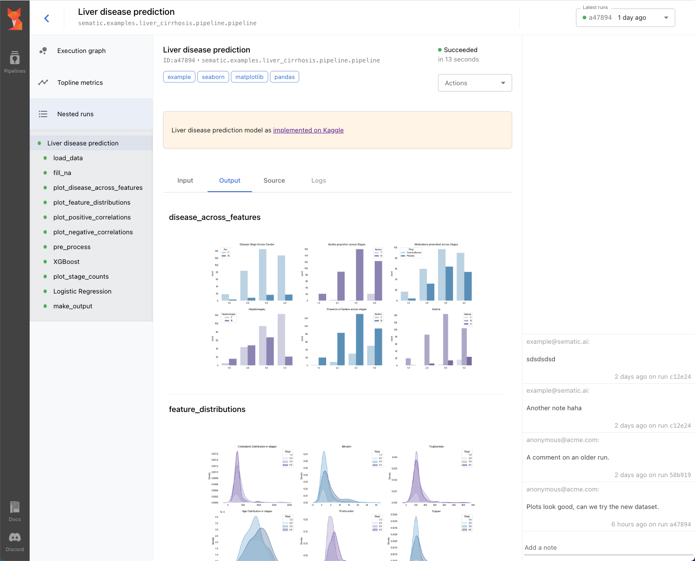
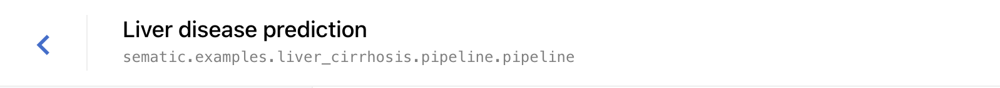
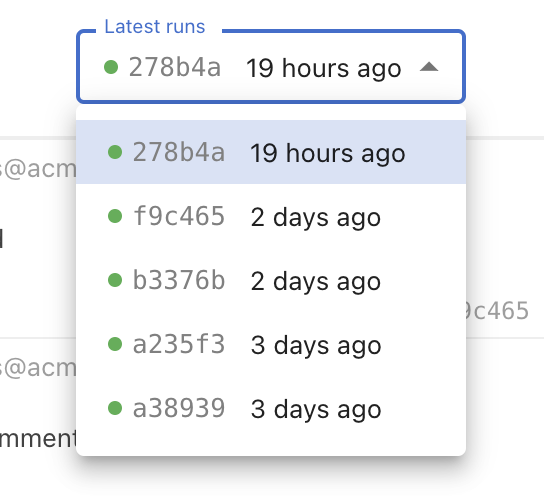
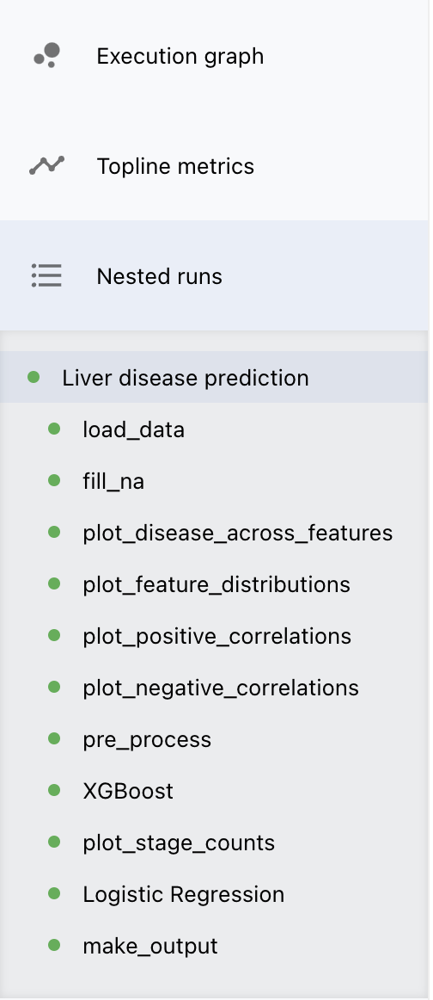
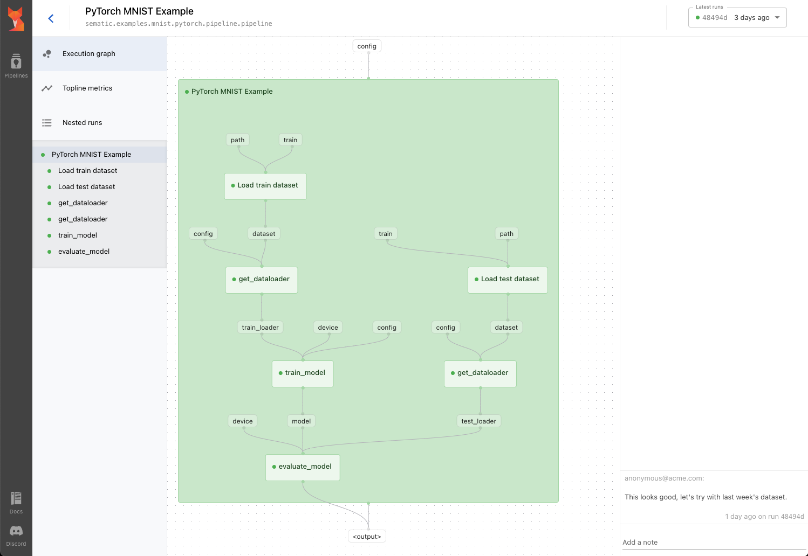
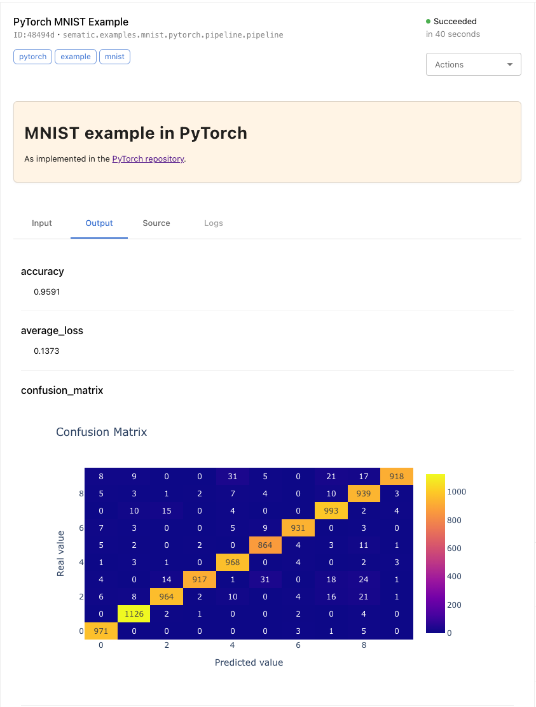
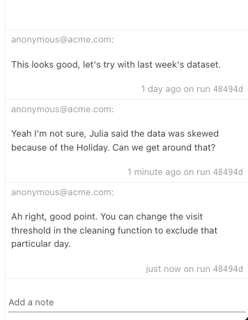

Sematic comes with a semantic UI that lets you do the following things:

* Track your pipelines execution
* Visualize and inspect the execution graph or your pipelines
* Track and visualize each Sematic Function's inputs and outputs
* Collaborate and share documentation, notes, and insights with your team
* [soon] Re-run/clone pipelines with different input configurations
* [soon] Schedule pipelines to keep models and dashboard fresh and relevant

## Pipeline View layout

You can see below the basic layout of the Pipeline View.

Let's go through each component of the view.

### Side Bar

At the far left, the dark sidebar lets you return to the Home page, the
Pipeline index, access these docs or join our [Discord
Server](https://discord.gg/4KZJ6kYVax).

### Pipeline Bar

At the very top, the horizontal bar provides baseline information about the
Pipeline you are viewing. You can see the name you gave it in your code, as well
as the pipeline's full import path.

### Latest Runs Dropdown

At the far left of the Pipeline Bar, you will find a dropdown menu with all the
recent executions of your pipeline. You can quickly switch between different
executions.

The six-character string you see in the dropdown corresponds to the first six
characters of the pipeline run ID. Every time you run the pipeline, a new item
will appear in this dropdown.

### Menu Panel

The grey panel to the left is the Menu Panel. Three items are listed:

* **Execution graph** – this will open the Graph Panel in the central area. See
  [Graph Panel](#graph-panel).
* [Coming soon] **Topline metrics** – this will display plots of the main
  metrics of your pipeline across successive executions
* **Nested runs** – This lists all the nested runs of your pipeline in a
  tree view. This is a summarized view of the execution graph visible in the
  [Graph Panel](#graph-panel). You can click and select any run to view it in
  the central [Run Panel](#run-panel)

### Graph Panel

The graph panel shows the execution graph of your pipeline as a series of nested
Directed Acyclic Graph (DAG).

Each box with a status pin (the tiny green spots) corresponds to a Sematic
Function's run. You can click on them to open the corresponding run in the
central [Run Panel](#run-panel) in order to inspect its details.

### Run Panel

When a run is selected in the [Graph Panel](#graph-panel) or in the [Menu
Panel](#menu-panel), the Run Panel shows the run details in the central area.

In this panel you can inspect and visualize:

* Run metadata: name, full import path, docstring (supports Markdown), execution
  status and wall time
* Run inputs and outputs
* Source code
* logs

### Notes Panel

On the far right side of the screen, you will find the Notes Panel where you can
collaborate with your team and exchange notes and comments about the pipeline's
outputs.

Notes of all the runs are showed but notes are always attached to a specific run in
order to maintain the history and context of the conversation.