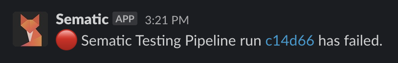


This feature is in "Beta."


## Using Slack with Sematic

Sematic currently automatically sends [Resolution](glossary.md#resolution)
failure notifications to a [Slack](https://slack.com/) channel that has
[Incoming Webhooks configured](https://api.slack.com/messaging/webhooks), if
configured:



## Configuration

First you'll need to configure a
[Slack App](https://slack.com/help/articles/360001537467-Guide-to-apps-in-Slack)
and activate [Incoming Webhooks](https://api.slack.com/messaging/webhooks) for
a channel in your workspace. Save the token that comes after
`https://hooks.slack.com/services/` in the Webhook URL generated for that
channel.

After this is done, you can then configure the Sematic server itself to send
notifications to this channel by following the appropriate instructions below.

### Local Sematic Configuration

To configure your [local Sematic installation](local-execution.md), use [the
CLI](cli.md) to set these settings:

```bash
$ # this is the token from the Slack App Webhook URL
$ sematic settings set -p sematic.plugins.publishing.slack.SlackPublisher \
>     SLACK_WEBHOOK_TOKEN XXX/YYY/ZZZ
$  # this is an externally-accessible URL for your Dashboard,
$  # used to construct the notification message
$ sematic server-settings set SEMATIC_DASHBOARD_URL https://my.sematic
```

### Cloud Deployment Sematic Configuration

To configure your [cloud Sematic
deployment](deploy.md#deployment-option-2-sematic-with-cloud-execution) to send
notifications to Slack, you need to add these settings to the `values.yaml`
file you use in your Helm deployment:

```yaml
slack:
  # this actually enables the integration
  enabled: true
  # this is the token from the Slack App Webhook URL
  slack_webhook_token: XXX/YYY/ZZZ

ingress:
  # this is an externally-accessible URL for your Dashboard,
  # used to construct the notification message
  sematic_dashboard_url: https://my.sematic
```
