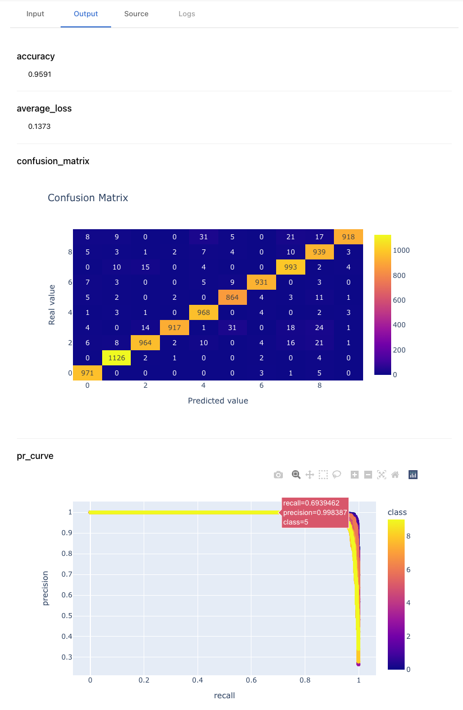

Sematic Functions need to be annotated with Python 3 style type hints.

The type hints are used in the following way:

* It is generally good practice to annotate your code, at least as documentation 🙂
* [Runtime type checking](#runtime-type-checking) of input and output values
* [Pseudo-static type checking](#pseudo-static-type-checking) prior to execution
*  Visualization in the UI

## Runtime type checking

In regular Python, type hints are used by mypy for static type checking but are
not actually enforced at runtime.

If a function declares it expects an argument `foo: int`, but `"abc"` is
passed, Python will not complain. This at-times practical behavior can be
detrimental in long-running pipelines. Imagine a pipeline failing after 12 hours
of processing because of a silly mistyped input (e.g. `foo / 2` in the case above).

Appropriately typing your functions can save a lot of time in your development
and debugging workflow.

This is how it works in Sematic. Let's take the following example:

```python
@sematic.func
def f(a: int) -> int:
    return "foo"
```

This function is obviously incorrectly typed, but in plain Python, this would
not be an issue.

Let's execute this Sematic Function:

```
>>> future = f("abc")
TypeError: Invalid input type for argument 'a' when calling '__main__.f'. Cannot cast 'abc' to <class 'int'>
```

Sematic will not even let us generate a future of `f`.

Now let's pass a valid `int`:

```
>>> future = f(1)
>>> future.resolve(tracking=False)
TypeError: Invalid output type for '__main__.f'. Cannot cast foo to <class 'int'>
```
Generating the future works fine since `1` is a valid `int`, however resolving
the future (i.e. actually executing the function) raises a `TypeError` since the
output value `"foo"` is not a valid `int`.



Runtime type checking ensures greater safety and reliability of your pipelines.



## Pseudo-static type checking

Because Sematic constructs the execution graph of your pipeline using futures
whose type is known (thanks to your type annotations), it is able to also fail
even before any concrete values are known, potentially saving you many hours of
wasted compute or debugging.

Consider the following example:

```python
@sematic.func
def g() -> str:
    return "g"

@sematic.func
def h(a: int) -> int:
    return a
```

If these were regular Python functions, the following would work just fine:

```
>>> h(g())
"g"
```

However, with Sematic Functions, the following occurs

```
>>> h(g())
TypeError: Invalid input type for argument 'a' when calling '__main__.h'. Cannot cast <class 'str'> to <class 'int'>.
```



Pseudo-static type checking ensures that blatant type incompatibilities are
raised as early as possible to save you compute and debugging time.




## Visualizations in the UI

Thanks to your type hints, Sematic know how to display your input and output
values in the UI.

Sematic can serialize and summarize all your artifacts for visualization and
deserialization at a later time (e.g. cloning, re-running, etc).

For example the following type hints:

```python
@dataclass
class EvaluationResults:
    accuracy: float
    average_loss: float
    confusion_matrix: plotly.graph_objs.Figure
    pr_curve: plotly.graph_objs.Figure


@sematic.func
def evaluate_model(
    model: nn.Module, test_loader: DataLoader, device: torch.device
) -> EvaluationResults:
```

will yield the following visualizations in the UI.



## What types are supported

By default, Sematic tries to be smart enough to support all types:

* builtins: `int`, `float`, `str`, `bool`, `byte`, `None`
* `typing` generics: `List[T]`, `Tuple[T, ...]`, `Dict[K, V]`, `Optional[T]`,
  `Union[T, ...]`, etc.
* dataclasses: class decorated with `@dataclass` are the recommended way to
  group configuration values
* `datatime.datetime`
* enums
* Arbitrary classes

For the latter, Sematic provides baseline type-checking (`issubclass`,
`isinstance`) and visualization (using `repr`).

In addition, Sematic supports popular third-party types and adds more support
every week. At this time, Sematic supports

* `pandas.DataFrame`, `pandas.Series`
* `torch.nn.Module`, `torch.Tensor`
* `plotly.graph_objs.Figure`
* `matplotlib.figure.Figure`

See
[sematic/types/types](https://github.com/sematic-ai/sematic/tree/main/sematic/types/types)
for the current list of support types.

Get in touch on [Discord](https://discord.gg/4KZJ6kYVax) for more type support, or
learn how to customize support for your types.
