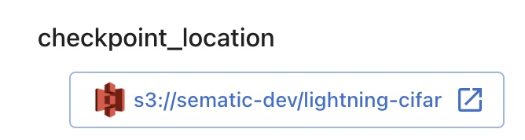
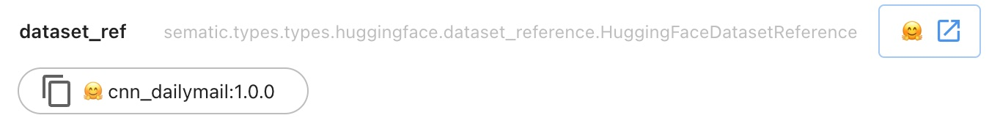
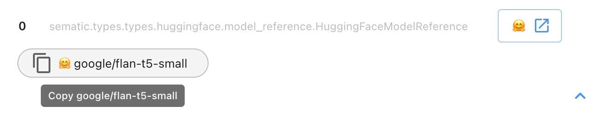
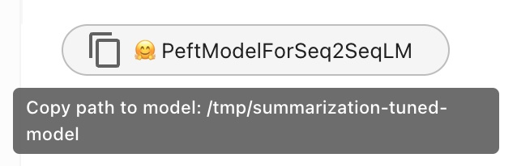

# Types

Sematic comes with a number of types for greater convenience. These types may
have special support within Sematic, such as custom visualizations in the
dashboard.

## The `Image` type

If you need to output an image in your Sematic function, you can use the `Image` type.

```python
from sematic.types import Image

@sematic.func
def my_function() -> Dict[str, Image]:
    with open("/path/to/image.png", "rb") as f:
        car_image = Image(bytes=f.read())
    # Or
    people_image = Image.from_file("/path/to/other_image.png")

    return {"car": car_image, "people": people_image}
```

The images will be persisted in Sematic's artifact store and displayed in the Output tab of the function's run.


An `Image` object can be returned by itself, or as part of greater output type,
as shown in the example above (e.g. dataclass, dictionary, tuple, list, etc.).

All image types that are supported by browsers are supported.

## The `Link` type

If you need to output a URL in one of your Sematic functions and you would like
this URL to be clickable in the dashboard, use the `Link` type as such:

```python
from sematic.types import Link

@sematic.func
def my_function() -> Link:
    return Link(
        label="Sematic documentation",
        url="https://docs.sematic.dev",
    )
```

The following button will be shown.


Note that you can also return an instance of `Link` as part of a dataclass,
list, tuple, or dictionary as well.

## Pandas dataframes

Using a pandas data frame as an input/output from a Sematic func will result in
a summary of that data frame being displayed.


## AWS Types

### `S3Bucket`

This type represents a storage bucket in S3. You can initialize it as follows:

```python
from sematic.types import S3Bucket

@sematic.func
def my_function() -> S3Bucket:
    return S3Bucket(
        name="my-bucket",
        region="us-west-1",  # region is optional
    )
```

Taking this as an input or returning it as an output will render a link to the bucket
in the Sematic dashboard.

### `S3Location`

This type represents a blob or directory in S3. You can initialize it as follows:

```python
from sematic.types import S3Bucket, S3Location

@sematic.func
def my_function() -> S3Location:
    return S3Location(
        bucket=S3Bucket(
            name="my-bucket",
            region="us-west-1",  # region is optional
        ),
        location="path/to/blob",
    )
```

Alternatively, a shorthand for the above would be:

```python
from sematic.types import S3Location

@sematic.func
def my_function() -> S3Location:
    return S3Location.from_uri(
        uri="s3://my-bucket/path/to/blob",
        region="us-west-1",  # region is optional
    )
```

Taking this as an input or returning it as an output will render a link to the bucket
in the Sematic dashboard.



S3 only emulates a file system through key-value pairs and does not have an actual
hierarchical directory structure. As a convention, locations that end in a "/" are
rendered as "directories", and those that do not are interpreted as fully-qualified
file paths.

`S3Location` can also be used in the following ways:

```python

location = S3Location.from_uri("s3://my-bucket/path/to/blob")


# refers to s3://my-bucket/path/to
dir_location = location.parent_directory

# refers to s3://my-bucket/path/to/other-blob
sib_location = location.sibling_location("other-blob")

# refers to s3://my-bucket/path/to/yet-another-blob
another_location = dir_location.child_location("yet-another-blob")

# refers to s3://my-bucket/path/to/the-last-one
last_blob = dir_location / "the-last-one"
```

## Snowflake tables

See [Snowflake integration](./snowflake.md).

## Plotly figures

Simply return any `plotly.graph_objs.Figure` from a Sematic func (either directly or as part of a `dataclass`, `Dict`, `List`, or other supported collection type) and it will be displayed in the UI.

## Hugging Face Types

### Dataset Reference

A reference to a dataset on Hugging Face Hub.

When represented as a string, has the slug format:
`[owner/]repo[:subset][@commit_sha]`

Pieces in square brackets are optional. Examples:

`the_owner/the_repo:the_subset@1234567890123456789012345678901234567890`
`the_repo`
`the_repo@1234567890123456789012345678901234567890`

The fields of the type are:
- **owner**: The owner of the dataset repo. If this is set to None, the repo will be
  assumed to be owned by Hugging Face staff.
- **repo**: The dataset repo.
- **subset**: The subset of the dataset. If this is set to None, the reference is to the whole
  dataset.
- **commit_sha**: The commit sha of the specific dataset version to be used. If this is set to
  `None`, the reference is to the latest commit (which may change depending on when the
  reference is used).

```python
from sematic.types import HuggingFaceDatasetReference

@sematic.func
def my_function() -> HuggingFaceDatasetReference:
    reference = HuggingFaceDatasetReference(
        owner="the_owner",
        repo="the_repo",
        subset="the_subset",
        commit_sha="1234567890123456789012345678901234567890",
    )
    # or, equivalently:
    # reference = HuggingFaceDatasetReference.from_string(
    #     "the_owner/the_repo:the_subset@1234567890123456789012345678901234567890"
    # )
    return reference
```

Using this type as the input/output to/from a Sematic function will render
a link to Hugging Face Hub, as well as a button to copy the slug.



A dataset reference can be converted to the string slug format described above
by calling `to_string` on it:

```python
reference.to_string(full_dataset=False)
```

The parameter `full_dataset` only matters if the reference has a `subset`
field that is not `None`. In that case, setting it to `True` will omit
the subset from the generated string.

### Model Reference

A reference to a model on Hugging Face Hub.

When represented as a string, has the slug format:
`[owner/]repo[@commit_sha]`

Pieces in square brackets are optional. Examples:

`the_owner/the_repo@1234567890123456789012345678901234567890`
`the_repo`
`the_repo@1234567890123456789012345678901234567890`

The fields of the type are:
- **owner**: The owner of the model repo. If this is set to None, the repo will be
  assumed to be owned by Hugging Face staff.
- **repo**: The model repo.
- **commit_sha**: The commit sha of the specific model version to be used. If this is set to
  `None`, the reference is to the latest commit (which may change depending on when the
  reference is used).

```python
from sematic.types import HuggingFaceModelReference

@sematic.func
def my_function() -> HuggingFaceModelReference:
    reference = HuggingFaceModelReference(
        owner="the_owner",
        repo="the_repo",
        commit_sha="1234567890123456789012345678901234567890",
    )
    # or, equivalently:
    # reference = HuggingFaceModelReference.from_string(
    #     "the_owner/the_repo@1234567890123456789012345678901234567890"
    # )
    return reference
```

Using this type as the input/output to/from a Sematic function will render
a link to Hugging Face Hub, as well as a button to copy the slug.



A model reference can be converted to the string slug format described above
by calling `to_string` on it:

```python
reference.to_string()
```

### Stored Model

This type is meant to refer to a [Hugging Face](https://huggingface.co/) model
that has been stored in local storage (at this time, no remote storage is
supported for this type). It can be used as follows:

```python
from sematic.types import HuggingFaceStoredModel
from transformers import AutoModelForSeq2Seq  # Can be any pre-trained model

@sematic.func
def my_function_producing_a_model() -> HuggingFaceStoredModel:
    model = AutoModelForSeq2SeqLM.from_pretrained("some/model")
    return HuggingFaceStoredModel.store(model, "/tmp/some/path")

@sematic.func
def my_function_using_a_model(stored_model: HuggingFaceStoredModel) -> str:
    model = stored_model.load(
        # keyword arguments will be passed to
        # the model's from_pretrained method
        device_map="auto"
    )
    return model.generate("Prompt to use for generation")
```

Doing so will render a visualization in the UI that displays the
type of the model and allows you to copy the model's storage path.



The model that is stored/loaded can be any pre-trained
[`transformers`](https://huggingface.co/docs/transformers/index)
model. The model may also be a
[`peft`](https://huggingface.co/docs/peft/index) model. In the latter
case, both the adaptor and the base model will be stored.

If you wish to store only the peft adaptor model, and load from Hugging
Face Hub on load instead of from a locally stored version, pass
`base_model_reference` into `store` when creating the
`HuggingFaceStoredModel`:

```python
from sematic.types import HuggingFaceStoredModel, HuggingFaceModelReference
from transformers import AutoModelForSeq2Seq  # Can be any pre-trained model
from peft import PeftModelForSeq2SeqLM  # Can be any peft model


base_model_reference = HuggingFaceModelReference.from_string(
    AutoModelForSeq2SeqLM, "some/model"
)
base_model = AutoModelForSeq2SeqLM.from_pretrained(
    base_model_reference.repo_reference()
)
# ...
# create and tune a peft model that uses the above as base
# ...

stored_model = HuggingFaceStoredModel.store(
    peft_model, "/tmp/some/path", base_model_reference
)

# When `load` is called on the stored model, the base model will
# be pulled from Hugging Face Hub instead of local storage.
```

