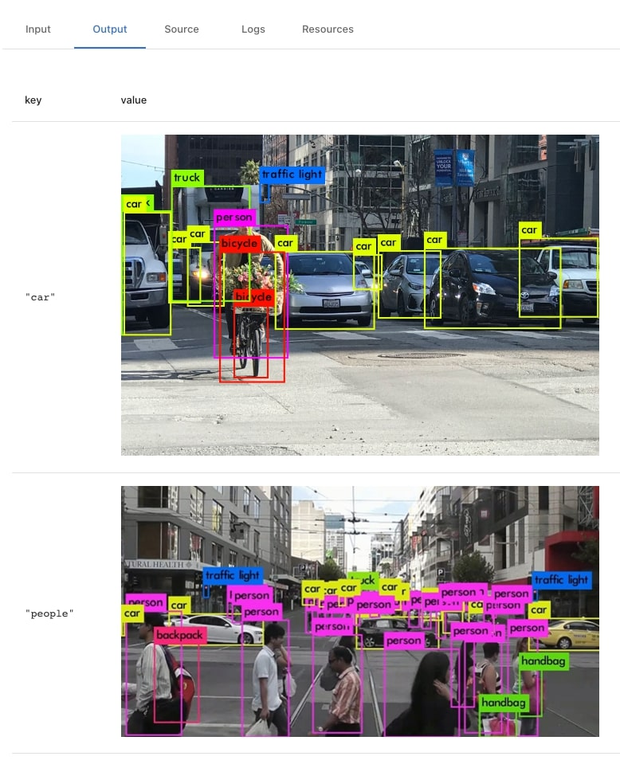
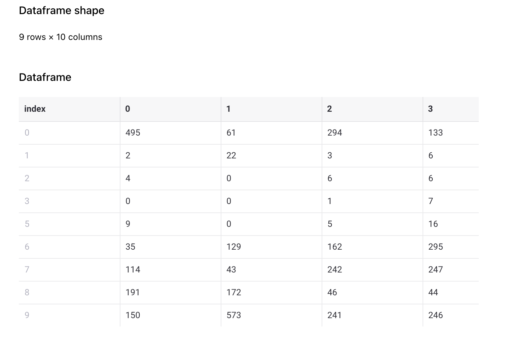

# Types

Sematic comes with a number of types for greater convenience. These types may
have special support within Sematic, such as custom visualizations in the
dashboard.

## The `Image` type

If you need to output an image in your Sematic function, you can use the `Image` type.

```python
from sematic.types import Image

@sematic.func
def my_function() -> Dict[str, Image]:
    with open("/path/to/image.png", "rb") as f:
        car_image = Image(bytes=f.read())
    # Or
    people_image = Image.from_file("/path/to/other_image.png")

    return {"car": car_image, "people": people_image}
```

The images will be persisted in Sematic's artifact store and displayed in the Output tab of the function's run.



An `Image` object can be returned by itself, or as part of greater output type,
as shown in the example above (e.g. dataclass, dictionary, tuple, list, etc.).

All image types that are supported by browsers are supported.

## The `Link` type

If you need to output a URL in one of your Sematic functions and you would like
this URL to be clickable in the dashboard, use the `Link` type as such:

```python
from sematic.types import Link

@sematic.func
def my_function() -> Link:
    return Link(
        label="Sematic documentation",
        url="https://docs.sematic.dev",
    )
```

The following button will be shown.


Note that you can also return an instance of `Link` as part of a dataclass,
list, tuple, or dictionary as well.

## Pandas dataframes

Using a pandas data frame as an input/output from a Sematic func will result in
a summary of that data frame being displayed.



## Snowflake tables

See [Snowflake integration](./snowflake.md).

## Plotly figures

See [Plotly integration](./plotly.md).
