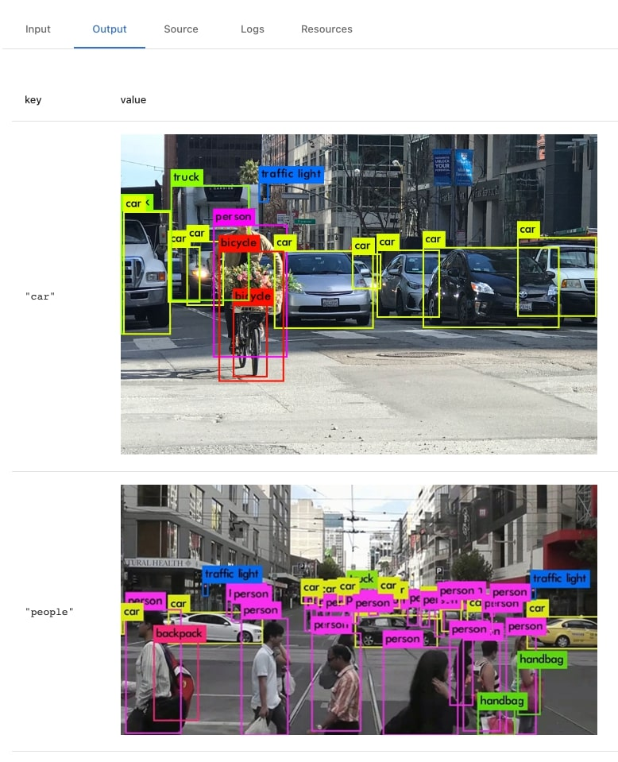
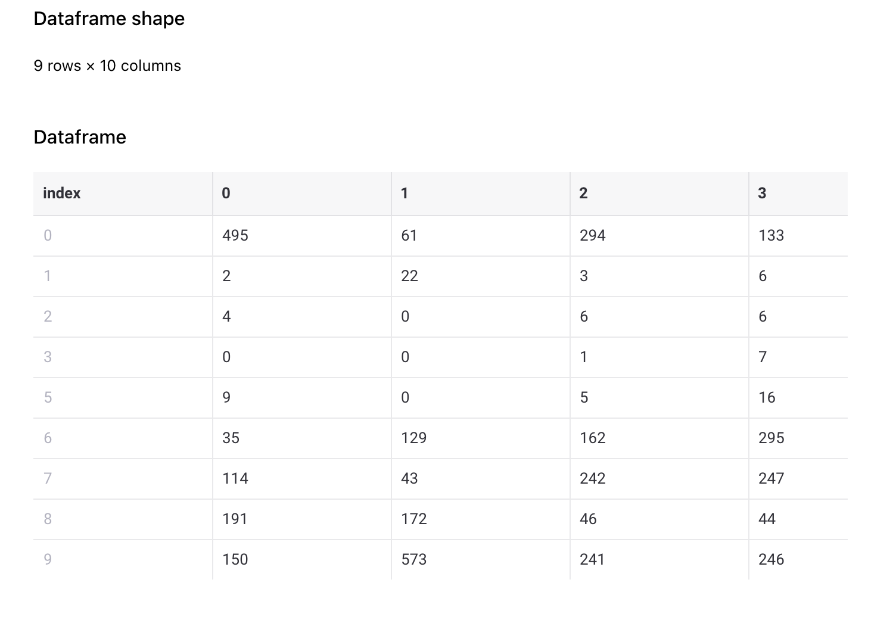
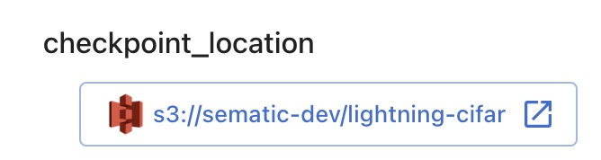

# Types

Sematic comes with a number of types for greater convenience. These types may
have special support within Sematic, such as custom visualizations in the
dashboard.

## The `Image` type

If you need to output an image in your Sematic function, you can use the `Image` type.

```python
from sematic.types import Image

@sematic.func
def my_function() -> Dict[str, Image]:
    with open("/path/to/image.png", "rb") as f:
        car_image = Image(bytes=f.read())
    # Or
    people_image = Image.from_file("/path/to/other_image.png")

    return {"car": car_image, "people": people_image}
```

The images will be persisted in Sematic's artifact store and displayed in the Output tab of the function's run.



An `Image` object can be returned by itself, or as part of greater output type,
as shown in the example above (e.g. dataclass, dictionary, tuple, list, etc.).

All image types that are supported by browsers are supported.

## The `Link` type

If you need to output a URL in one of your Sematic functions and you would like
this URL to be clickable in the dashboard, use the `Link` type as such:

```python
from sematic.types import Link

@sematic.func
def my_function() -> Link:
    return Link(
        label="Sematic documentation",
        url="https://docs.sematic.dev",
    )
```

The following button will be shown.


Note that you can also return an instance of `Link` as part of a dataclass,
list, tuple, or dictionary as well.

## Pandas dataframes

Using a pandas data frame as an input/output from a Sematic func will result in
a summary of that data frame being displayed.




## AWS Types

### `S3Bucket`

This type represents a storage bucket in S3. You can initialize it as follows:

```python
from sematic.types import S3Bucket

@sematic.func
def my_function() -> S3Bucket:
    return S3Bucket(
        name="my-bucket",
        region="us-west-1",  # region is optional
    )
```

Taking this as an input or returning it as an output will render a link to the bucket
in the Sematic dashboard.

### `S3Location`

This type represents a blob or directory in S3. You can initialize it as follows:

```python
from sematic.types import S3Bucket, S3Location

@sematic.func
def my_function() -> S3Location:
    return S3Location(
        bucket=S3Bucket(
            name="my-bucket",
            region="us-west-1",  # region is optional
        ),
        location="path/to/blob",
    )
```

Alternatively, a shorthand for the above would be:

```python
from sematic.types import S3Location

@sematic.func
def my_function() -> S3Location:
    return S3Location.from_uri(
        uri="s3://my-bucket/path/to/blob",
        region="us-west-1",  # region is optional
    )
```

Taking this as an input or returning it as an output will render a link to the bucket
in the Sematic dashboard.



S3 only emulates a file system through key-value pairs and does not have an actual
hierarchical directory structure. As a convention, locations that end in a "/" are
rendered as "directories", and those that do not are interpreted as fully-qualified
file paths.

`S3Location` can also be used in the following ways:

```python

location = S3Location.from_uri("s3://my-bucket/path/to/blob")


# refers to s3://my-bucket/path/to
dir_location = location.parent_directory

# refers to s3://my-bucket/path/to/other-blob
sib_location = location.sibling_location("other-blob")

# refers to s3://my-bucket/path/to/yet-another-blob
another_location = dir_location.child_location("yet-another-blob")

# refers to s3://my-bucket/path/to/the-last-one
last_blob = dir_location / "the-last-one"
```

## Snowflake tables

See [Snowflake integration](./snowflake.md).

## Plotly figures

Simply return any `plotly.graph_objs.Figure` from a Sematic func (either directly or as part of a `dataclass`, `Dict`, `List`, or other supported collection type) and it will be displayed in the UI.

## Hugging Face Types

### Stored Model

### Model Reference

### Dataset Reference
