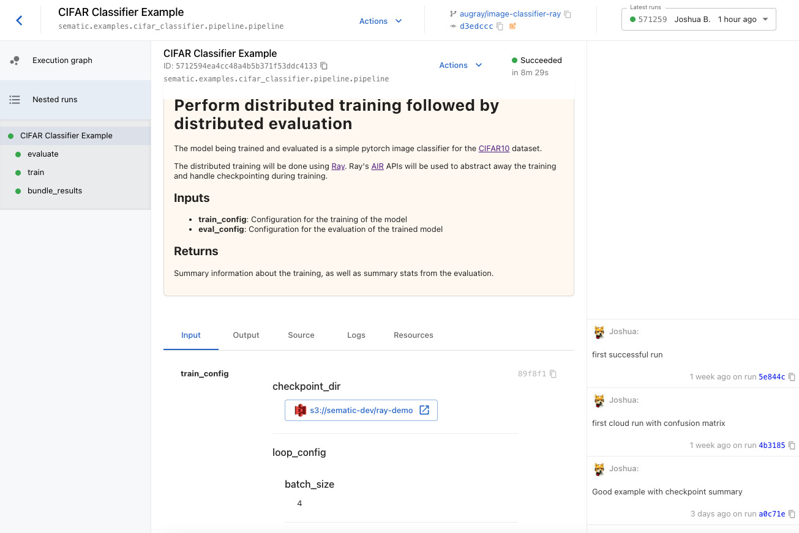

# CIFAR10 Image Classifier with Ray AIR

This trains a simple image classifier for the
[CIFAR10](https://www.cs.toronto.edu/~kriz/cifar.html) dataset of 32x32
images. The classifier is a simple PyTorch model trained using distributed
training and distributed evaluation supported by Ray.

The APIs used to manage the distributed compute come from Ray's
[AI Runtime](https://docs.ray.io/en/latest/ray-air/getting-started.html),
a set of Beta APIs for doing end-to-end ML in a distributed computing
context.

## Screenshots


*Displays hyperparameters, compute configurations, docstrings, and any*
*inputs you can imagine, right in the dashboard*


*Get live information about execution including logs and the state*
*of any computing resources your job uses*


*Display statistics, plotly figures, and more to summarize*
*the results of your execution*

## Running

After updating [main.yaml](./main.yaml) with your own registry and repository,
you can launch the pipeline with:

```bash
$ sematic run --build sematic/examples/cifar_classifier/main.py -- --cloud
```
