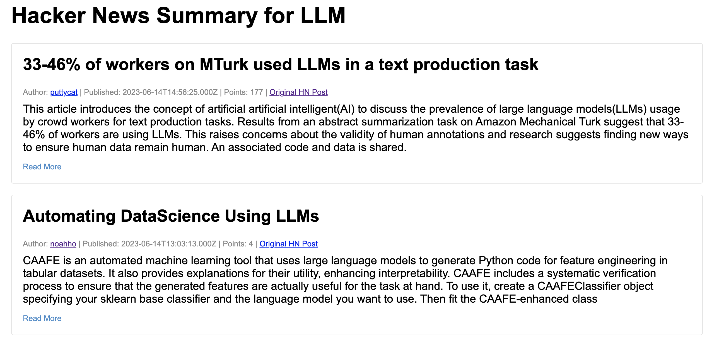

# Hacker News Summarization

This example fetches stories from Hacker News based on an input query and uses an LLM to summarize them, and generates a HTML page of the stories fetched.

\**We skip "**ASK HN:**" stories from summarization since purpose is to summarize informative articles and not questions posted on HackerNews*

## Prerequisites

This example uses LLMs via API so you need to have an API key for one of these services:
* [OpenAI API](https://openai.com/blog/openai-api)
* [Cohere API](https://dashboard.cohere.ai/welcome/register)

## Usage

Arguments
- `--query` **(required)** : Search query. Example "llm", "generative AI"
- `--past-n-days`: Past N number of days to fetch stories for
- `--max-stories` : Number of stories you'd want to fetch from HN
- `--max-tokens` : Max number of tokens

### For Cohere
- `--cohere-model` : Model you want to use for text summarization.
- `--cohere-api-key` **(required)**: API key

### For OpenAI
- `--openai-model` : Model you want to use for text summarization.
- `--openai-api-key` **(required)**: API key

Example usage:

```shell
$ sematic run examples/hackernews_summarization --query llm --openai-api-key '<API_KET>'
```

## Output

- The pipeline produces a summary HTML page of the stories. The path to this html can be found as the output of the last step in the pipeline (`prepare_report_html`).


*Screenshot of the summary HTML page*
