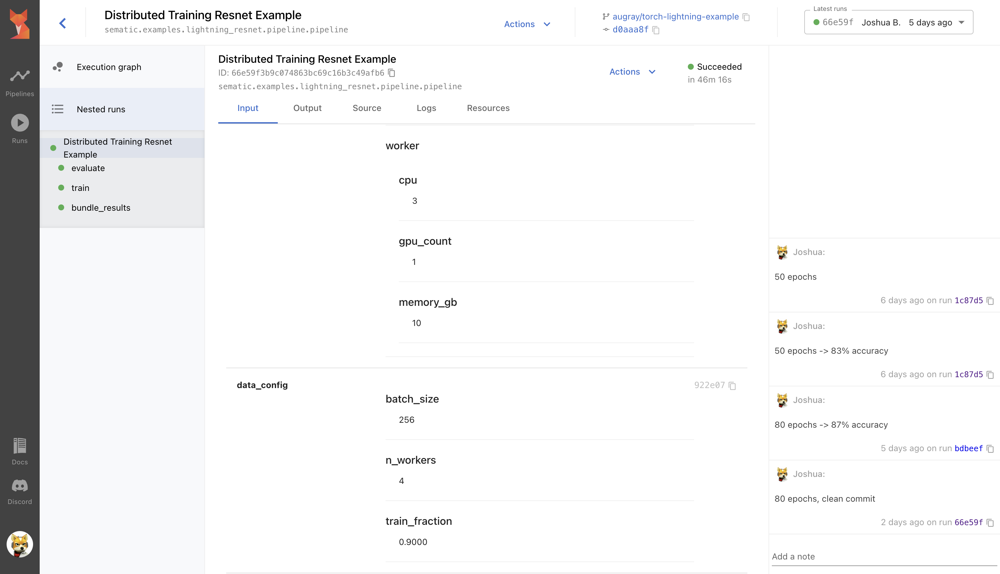
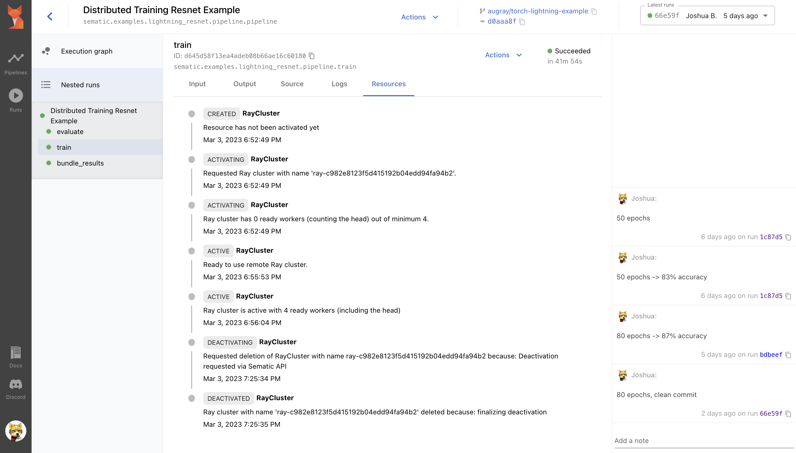

An example of using
[PyTorch Lightning](https://pytorch-lightning.readthedocs.io/en/stable/index.html)
to do distributed training of a model classifying images in the
[CIFAR100 dataset](https://www.cs.toronto.edu/~kriz/cifar.html)
using Resnet.

This example can only be run on Kubernetes clusters set up with sufficiently powerful
GPU nodes enabled. It makes use of Sematic's Ray integration, which is available in
Sematic EE.

The modeling code in `train_eval` is based on an example from
[the pytorch lightning documentation](https://pytorch-lightning.readthedocs.io/en/stable/notebooks/lightning_examples/cifar10-baseline.html)
It is available under the license [CC BY-SA](https://creativecommons.org/licenses/by-sa/2.0/)

This pipeline also illustrates how you can test the end-to-end connections between
steps in your pipeline to reduce the chance that your pipeline will fail
mid-execution from a programming error. See [`test_pipeline.py`](./tests/test_pipeline.py).

## Screenshots

*Displays hyperparameters, compute configurations, docstrings, and any*
*inputs you can imagine, right in the dashboard*

*Get live information about execution including logs and the state*
*of any computing resources your job uses*

*Display statistics, plotly figures, and more to summarize*
*the results of your execution*
