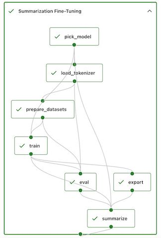

# Fine-Tuning Language Models with LoRA

This example shows a simple Sematic pipeline which:

- Downloads and splits a HuggingFace dataset containing contextual text paired
with a summary of that text. By default, uses the
[`cnn_dailymail`](https://huggingface.co/datasets/cnn_dailymail) dataset,
which contains news articles and summaries of those articles. However,
any dataset that has one column containing context and one column with a
summary of that text can be used.
- Fine-tunes the specified model using
[LoRA](https://arxiv.org/abs/2106.09685) (a mechanism to fine-tune LLMs while
leveraging far fewer free parameters in the tuning than are present in the original
model).
- Runs inference on the test data, displaying the results in Sematic.
- Exports the resulting fine-tined model to a HuggingFace repo of your choice.

## Models

### FLAN-T5

Google's [FLAN-T5](https://huggingface.co/google/flan-t5-base) model is
a sequence-to-sequence language model that has been shown to generalize well
to a variety of language tasks. Google has produced multiple variants of
this model, which make it ideal for scaling up your development workflow
from a "toy" version that runs on your laptop CPU to a fully-fledged LLM
that can achieve state-of-the-art performance.

The model variants are:

- **Flan-T5-Small**: 80M parameters
- **Flan-T5-Base**: 250M parameters
- **Flan-T5-Large**: 780M parameters
- **Flan-T5-XL**: 3B parameters
- **Flan-T5-XXL**: 11B parameters

### Llama 2

Meta's [Llama 2](https://huggingface.co/meta-llama/Llama-2-7b-chat) model
is a group of causal language models of varying sizes and fine-tunings.
Here, the variants used are fine-tuned for chat purposes. This example
pipeline will fine-tune them further for use-case specific summarization
tasks. Even the smallest variant has 7 billion parameters and will generally
require more than one GPU to effectively fine-tune. However, the performance
of Llama 2 models is state-of-the-art.

The model variants are:
- **Llama 2 7b Chat**
- **Llama 2 13b Chat**
- **Llama 2 70b Chat**


### GPT-J 6b

EleutherAI's (GPT-J 6b)[https://huggingface.co/EleutherAI/gpt-j-6b] model is
a causal language model, like GPT-4. This means that it primarily works to
extend existing sequences of text. Part of the fine-tuning performed
with our example usage will be to train the model to produce summaries
when given some context, rather than simply extending the context it's given.

In our fine tuning, we load it into memory with reduced precision (8bit), which
requires a compatible GPU. Despite this reduced precision, it still requires
substantial GPU memory if you want it to fit entirely in memory for training.

For the evaluation portion of the pipeline, we load it in full precision, which
tends to produce better results. Despite this, most single consumer-grade GPUs
cannot hold the whole model, so if you only have one GPU, the model may be
partly stored in CPU memory (via Hugging Face's
[accelerate](https://huggingface.co/docs/accelerate/index) library). This
can reduce the inference time substantially.

### Execution

This example only supports local execution. To run it:

- [install sematic](https://docs.sematic.dev/onboarding/get-started)
- `sematic start`
- `sematic run examples/summarization_finetune -- --help`
- If you see an error about missing libraries, install them with the provided command.
- Run the pipeline with the `flan-small` example, and an interactive evaluation, logging
into Hugging Face first:

```shell
sematic run examples/summarization_finetune -- \
  --max-train-samples 1 \
  --max-test-samples 1 \
  --model-selection flan-small \
  --launch-interactive \
  --login
```
- View the pipeline results in the Sematic UI at `http://localhost:5001`.
- Try a different dataset:

```
sematic run examples/summarization_finetune -- \
 --max-train-samples 1 \
 --max-test-samples 1 \
 --model-selection flan-base \
 --dataset amazon_us_reviews:Baby_v1_00 \
 --text-column review_body \
 --summary-column review_headline \
 --max-output-length 64
```

- Try Llama 2 using `--model-selection llama-2-7b-chat`
(though note this requires compatible hardware).
- Try GPT-J using `--model-selection gpt-j-6b`
(though note this requires compatible hardware).
- Try exporting your fine-tuned model to Hugging Face Hub using:
`--login --model-export-repo <hugging face repo owner>/<hugging face repo name>`.

- Change the configuration to the pipeline as desired. See the CLI help
with `sematic run examples/summarization_finetune -- --help` for options.


### Results

Here are some screenshots of what you'll get by using this example:



*The execution graph for the pipeline. When running live, the status*
*of each run will be updated as execution progresses. The export step*
*and an interactive debug step will only be shown if the pipeline is*
*launched with the appropriate arguments.*


*A part of the dashboard for the pipeline. 🤗 buttons link to the*
*corresponding resources on Hugging Face Hub. Input and output displays*
*are available for the overall pipeline, as well as all of the steps*
*within it.*


*Runs can be searched using tags, free text search, and more.*


*An interactive Gradio app can be optionally launched as part*
*of the pipeline. You can provide new prompts and view the summaries*
*the newly tuned model produces.*


*The prompts and responses from the interactive Gradio session are*
*tracked along with other pipeline inputs/outputs.*


*Results from the automatic evaluation are always tracked and*
*displayed.*

### Troubleshooting

If you don't have CUDA set up or installed, you may need to do that. Some Cuda dependencies will likely
get installed transitively when installing PyTorch, but some separate installation may be required.
You may find it helpful to `pip install nvidia-cusparse-cu11`.

If you see this error:
```
AttributeError: /lib/python3.9/site-packages/bitsandbytes/libbitsandbytes_cpu.so: undefined symbol: cget_col_row_stats
```
Then `bitsandbytes` was unable to load your Cuda binaries. You may need to modify your `LD_LIBRARY_PATH`
to allow it to find those libraries. Ex:
```
LD_LIBRARY_PATH="/lib/python3.9/site-packages/nvidia/cuda_runtime/lib:$LD_LIBRARY_PATH sematic run # ...
```

#### Hardware requirements

LLMs often have very specific requirements in terms of both hardware capabilities and
library versions. For reference on the hardware this example has been tested on:

- **Flan small/base**: M1 Mac, AWS `g5.2xlarge`
- **Flan large**: AWS `g5.2xlarge`
- **GPT-J 6b**: AWS `g5.2xlarge`
- **Llama 2 7b Chat**: AWS `g5.12xlarge`

If you try an example on other hardware, submit a PR to let others know!
